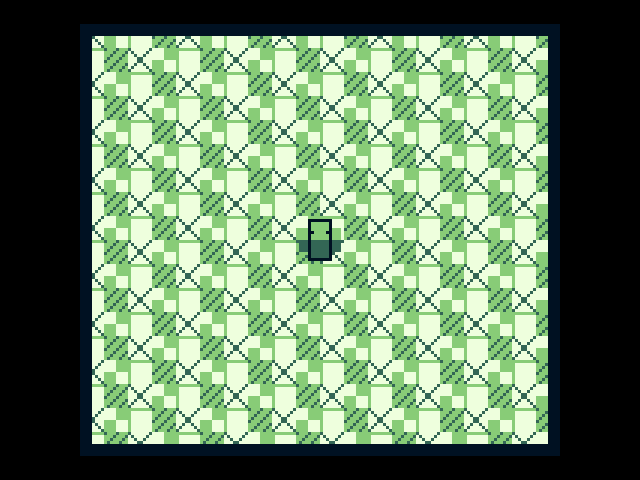
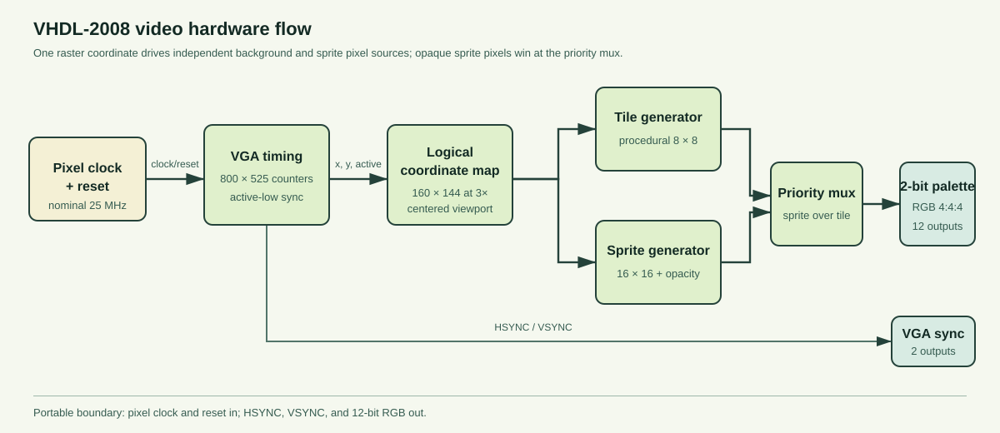

# Game Boy–Style VGA Pixel Pipeline

**A board-agnostic VHDL-2008 video pipeline that generates VGA timing and renders a small four-shade tile-and-sprite scene.**



## Purpose

This project focuses on one concrete digital-hardware problem: producing pixel coordinates, synchronization signals, and RGB values for a complete display frame. A 160×144 logical screen is enlarged by 3× integer pixel replication and centered inside a 640×480 VGA active area.

The implementation is a ground-up 2026 rebuild by **Uthso Paul** of the display-controller idea from a 2024 Computer Organization & Architecture team project with **Richard Gill**. The rebuilt source, testbenches, diagram, and simulation-generated frame in this repository are new and narrow the earlier broad system concept to a focused video design.

## Hardware pipeline



The RTL is divided into four small units:

1. **VGA timing** — advances 800×525 horizontal/vertical counters and produces active-low HSYNC and VSYNC.
2. **Coordinate mapping** — converts physical VGA coordinates into 160×144 logical pixel coordinates inside a centered 3× viewport.
3. **Pixel rendering** — generates a procedural 8×8 tile background and one original 16×16 sprite with transparent pixels.
4. **Priority and palette** — overlays opaque sprite pixels on the background and converts each 2-bit shade into 12-bit RGB (4:4:4).

The scope is intentionally limited to video hardware. It does not include a processor core, cartridge interface, commercial game code, or extracted artwork.

## Repository layout

```text
src/                       VHDL-2008 design units
tests/                     GHDL testbenches and repository contract tests
scripts/run_tests.py       Reproducible analysis, simulation, and asset check
scripts/ppm_to_png.py      Dependency-free frame conversion
docs/ARCHITECTURE.md       Timing and pixel-pipeline design
docs/VERIFICATION.md       Assertions, counts, and generated-evidence chain
docs/assets/               Project-owned diagram and generated VGA frame
```

## Run the simulation

Requirements: GHDL with VHDL-2008 support and Python 3.

```text
python scripts/run_tests.py
```

The command analyzes all design units, performs GHDL synthesis elaboration on `gb_video_top`, runs three simulations, produces a complete PPM frame from the top-level RGB outputs, converts it to PNG, and verifies that the result matches the committed image.

## Verified behavior

- one complete 800×525 timing frame checked cycle by cycle;
- 307,200 active VGA pixels per frame;
- 96-pixel active-low HSYNC pulse on every line;
- two-line active-low VSYNC pulse per frame;
- exact 480×432 centered viewport for the scaled 160×144 logical screen;
- blanking, viewport bounds, 3× replication, transparent sprite pixels, and sprite priority asserted;
- GHDL synthesis elaboration of the integrated top level;
- deterministic 640×480 simulation-generated frame checked against the committed PNG.

See [Architecture](docs/ARCHITECTURE.md) and [Verification](docs/VERIFICATION.md) for the exact constants and acceptance criteria.

## Attribution

Game Boy is a trademark of Nintendo. This independent educational project uses no Nintendo source code, ROM data, or artwork. The VHDL implementation and project-owned visuals are released under the [MIT License](LICENSE).
