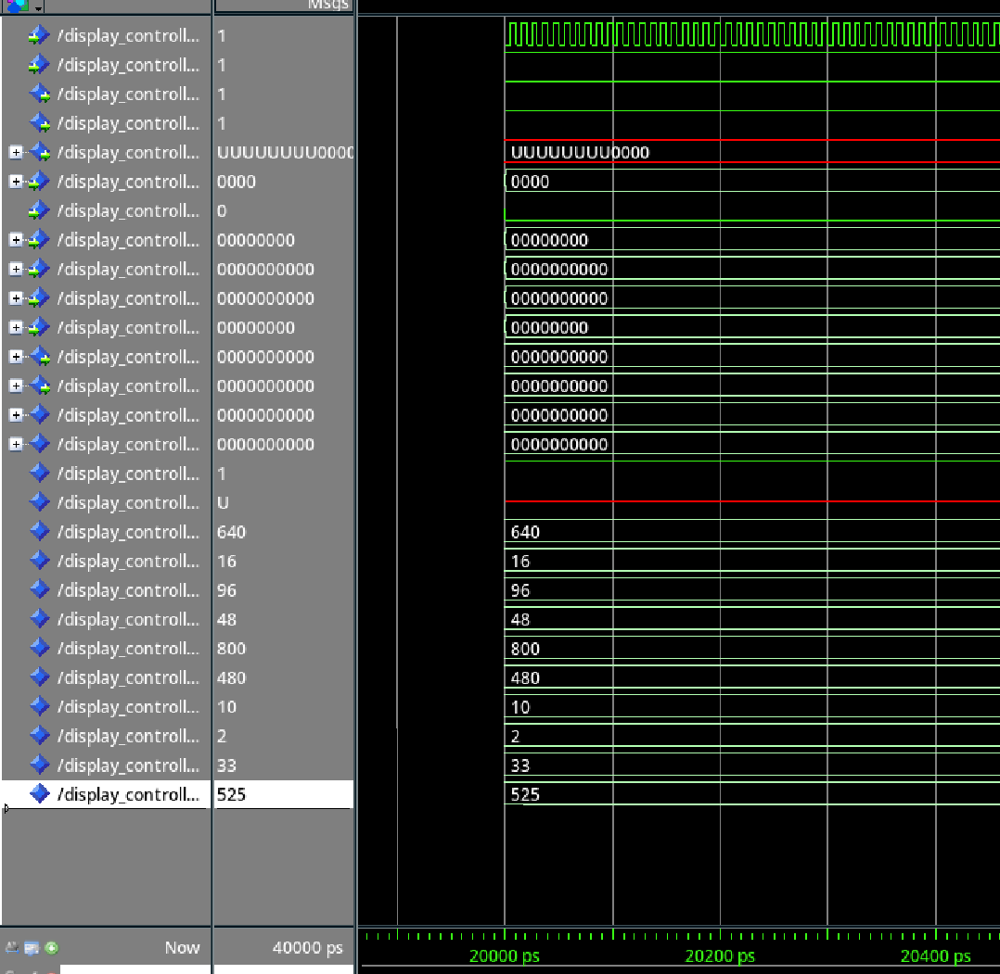
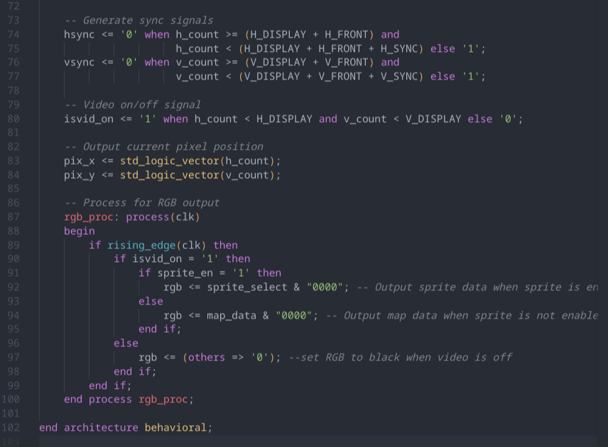
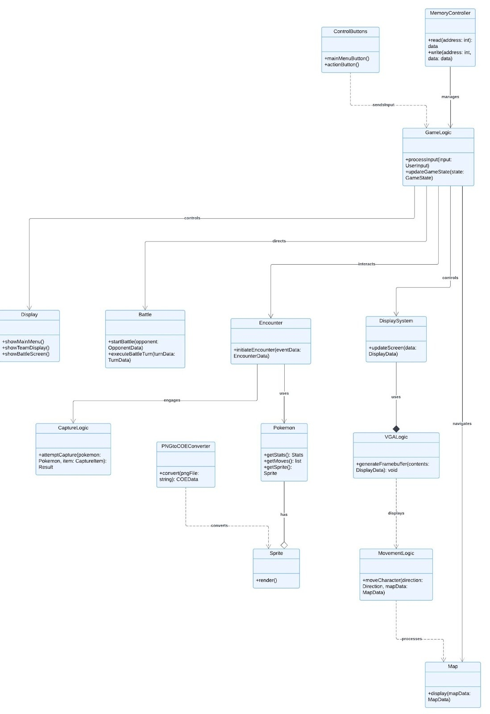

# Game Boy–Inspired VHDL Architecture Study

**Archived academic design study in VHDL, with a working focus on VGA timing and simulation.**

> **Status:** This was an ambitious December 2024 course project, not a completed Game Boy emulator or playable Pokémon implementation. The full CPU, memory, and game architecture was not validated. This repository preserves the report, diagrams, code excerpts, and simulation evidence without overstating the result.

## Project scope

The project attempted to express a small Pokémon/Game Boy–inspired architecture as synchronous digital hardware. Planned modules covered:

- player input and game-state control;
- battle and encounter behavior;
- profile, team, move, and type data;
- map and memory control;
- VGA timing and RGB display output.

The work was completed as a team project by **Uthso Paul and Richard Gill** for CSCI 155, Computer Organization & Architecture.

## What worked

The strongest implemented subsystem was the display controller:

- horizontal and vertical pixel counters;
- HSYNC and VSYNC timing;
- active-video gating;
- pixel-coordinate outputs;
- RGB selection between map and sprite inputs;
- ModelSim waveform inspection.

The simulation artifacts show the signals used to inspect the controller. They do not demonstrate a rendered game, a programmed FPGA, or a complete synthesized system.

## What did not work

The project initially treated VHDL too much like sequential programming. Several planned game, processor, and memory modules would need to be restructured around explicit registers, clocked datapaths, finite-state machines, and synthesizable memories before integration.

The main lessons were:

1. HDL describes concurrent hardware, not a sequence of software instructions.
2. Each subsystem needs a focused testbench and acceptance criteria before integration.
3. A semester digital-hardware project should be scoped around a small, demonstrable function.

## Tools and evidence environment

- VHDL
- ModelSim

The original report does not name a synthesis tool or FPGA platform and states that the team worked with no board or output display. The preserved artifacts therefore document source and simulation work, not FPGA deployment.

## Original architecture

## Project artifacts

- [Original course report](docs/Pokemon-VHDL-Project-Report.docx)
- [Architecture diagram](docs/assets/architecture-diagram.jpg)
- [VGA output logic excerpt](docs/assets/vga-output-logic.png)
- [Display-controller simulation waveform](docs/assets/vga-simulation-waveform.png)

## Attribution

This is an educational architecture study. Pokémon, Game Boy, and related marks belong to their respective owners. No game ROM, commercial game source code, or extracted game assets are included.
